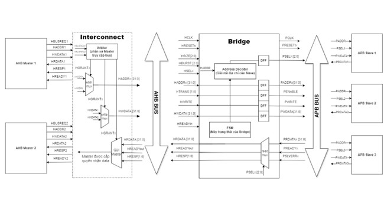
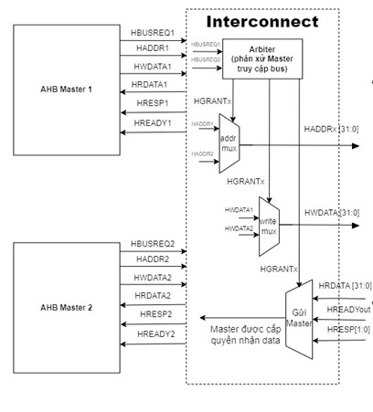
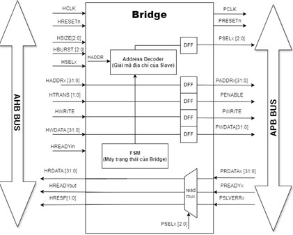
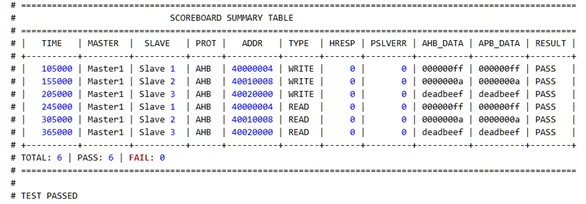
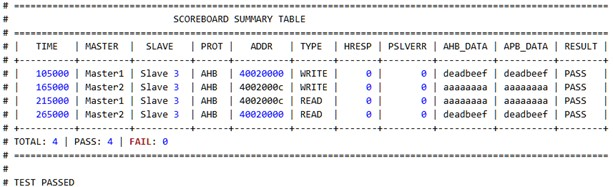

# Thiết Kế AHB-to-APB Bridge và Kiểm Chứng UVM

> **Đồ án tốt nghiệp**
> **Sinh viên:** Phạm Hùng Minh - MSSV: 6251020065
> **GVHD:** Lê Mạnh Tuấn
> **Khoa Điện - Điện tử, Đại học Giao thông vận tải Phân hiệu TP.HCM**

---

## Mục lục

- [Giới thiệu](#giới-thiệu)
- [Tổng quan hệ thống](#tổng-quan-hệ-thống)
- [Thiết kế DUT](#thiết-kế-dut)
- [Bản đồ địa chỉ](#bản-đồ-địa-chỉ)
- [Môi trường kiểm chứng UVM](#môi-trường-kiểm-chứng-uvm)
- [Cấu trúc thư mục](#cấu-trúc-thư-mục)
- [Chạy mô phỏng](#chạy-mô-phỏng)
- [Coverage](#coverage)
- [Kết quả mô phỏng](#kết-quả-mô-phỏng)
- [Ghi chú](#ghi-chú)

## Giới thiệu

Dự án xây dựng một **AHB-to-APB bridge** theo chuẩn AMBA, cho phép hai master AHB truy cập vào các thiết bị APB gồm:

- GPIO
- Timer
- Register File

Thiết kế được mô phỏng và kiểm chứng bằng **SystemVerilog + UVM** trên **QuestaSim/ModelSim**.

### Mục tiêu chính

- Thiết kế AHB interconnect và arbiter cho hai master.
- Chuyển đổi giao thức AHB sang APB.
- Triển khai APB slave cho GPIO, Timer và Register File.
- Xây dựng môi trường kiểm chứng UVM với scoreboard, coverage và regression.

## Tổng quan hệ thống

DUT chính nhận giao dịch từ bus AHB, sau đó:

1. Phân quyền master bằng arbiter.
2. Chuyển giao giao dịch đến bridge.
3. Đổi giao tiếp sang APB.
4. Truy cập APB slave theo vùng địa chỉ.



## Thiết kế DUT

Điểm bắt đầu thiết kế là `rtl/dut_top.v`.

### Thành phần chính

- `ahb_interconnect.v`: điều phối request từ master được grant và truyền sang bridge.
- `ahb_arbiter.v`: cấp phép truy cập bus AHB theo fixed priority hoặc round robin.
- `bridge_top.v`: lõi chuyển đổi AHB sang APB.
- `bridge_addr_decoder.v`: giải mã địa chỉ APB slave.
- `bridge_fsm.v`: điều khiển tuần tự AHB/APB, hỗ trợ read/write và pipelined write.
- `bridge_prdata_mux.v`: tổng hợp dữ liệu trả về cho AHB master.
- `apb_slave_gpio.v`: APB GPIO slave với thanh ghi DATA/DIR/IE.
- `apb_slave_timer.v`: APB Timer slave với CNT, PERIOD và IRQ.
- `apb_slave_regfile.v`: APB register file gồm 8 thanh ghi 32-bit.






## Bản đồ địa chỉ

Các slave APB được ánh xạ như sau:

| Vùng địa chỉ | Slave | Chức năng |
| --- | --- | --- |
| `0x4000_0000` - `0x4000_FFFF` | GPIO | DATA, DIR, IE |
| `0x4001_0000` - `0x4001_FFFF` | TIMER | CTRL, CNT, PERIOD |
| `0x4002_0000` - `0x4002_FFFF` | REGFILE | 8 thanh ghi 32-bit |

### GPIO register map

| Offset | Register | Chức năng |
| --- | --- | --- |
| `0x00` | `DATA_REG` | Dữ liệu GPIO `[7:0]` |
| `0x04` | `DIR_REG` | `1 = output`, `0 = input` |
| `0x08` | `IE_REG` | Interrupt enable |

### TIMER register map

| Offset | Register | Chức năng |
| --- | --- | --- |
| `0x00` | `CTRL_REG` | `CTRL[0] = enable` |
| `0x04` | `CNT_REG` | Counter, read-only |
| `0x08` | `PERIOD_REG` | Giá trị ngưỡng tạo interrupt |

### REGFILE register map

| Offset | Register |
| --- | --- |
| `0x00` - `0x1C` | `REG0` - `REG7` (8 x 32-bit) |

## Môi trường kiểm chứng UVM

Testbench top nằm ở `tb/tb_top.sv`.

### Thành phần UVM

- Agent AHB active: driver, sequencer, monitor.
- Agent APB passive: monitor.
- Scoreboard: so sánh transaction AHB và APB.
- Coverage collector: thu thập functional coverage và code coverage.
- Test suite: reset, ghi/đọc, arbiter, bridge, lỗi và coverage-directed.


## Cấu trúc thư mục

```text
.
├── rtl/                      # Thiết kế RTL
│   ├── ahb_arbiter.v
│   ├── ahb_interconnect.v
│   ├── bridge_addr_decoder.v
│   ├── bridge_fsm.v
│   ├── bridge_prdata_mux.v
│   ├── bridge_top.v
│   ├── apb_slave_gpio.v
│   ├── apb_slave_regfile.v
│   ├── apb_slave_timer.v
│   ├── dut_top.v
│   └── top.v
├── tb/                       # Testbench UVM
│   ├── agent/
│   ├── config/
│   ├── env/
│   ├── interface/
│   ├── pkg/
│   ├── sequence/
│   ├── test/
│   └── transaction/
├── sim/                      # Simulation và regression
│   ├── Makefile
│   ├── run.f
│   ├── modelsim.ini
│   ├── regression/
│   ├── work/
│   ├── log/
│   └── cov/
├── synthesis/                # File dự án Quartus và output synthesis
│   ├── AHB_APB_BRIDGE.qpf
│   ├── dut_top.qsf
│   ├── dut_top.sdc
│   ├── db/
│   ├── output_files/
│   └── incremental_db/
├── docs/
│   └── images/               # Hình ảnh minh họa
└── README.md
```

### Mô tả thư mục chính

- `rtl/`: chứa toàn bộ mã nguồn thiết kế RTL.
- `tb/`: chứa môi trường UVM, sequence, test và transaction.
- `sim/`: chứa script biên dịch, file chạy sim, regression và coverage.
- `synthesis/`: chứa file dự án Quartus, constraints và output synthesis.
- `docs/images/`: chứa ảnh kiến trúc, waveform, scoreboard và coverage.

## Chạy mô phỏng

### Yêu cầu phần mềm

- QuestaSim / ModelSim hỗ trợ SystemVerilog và UVM.
- UVM 1.2.
- `make`.
- Python 3.

### Thiết lập môi trường

```bash
cd sim
export UVM_HOME=/path/to/QuestaSim/uvm-1.2
```

Trong PowerShell:

```powershell
cd sim
$env:UVM_HOME = "C:\Questa\uvm-1.2"
```

### Các lệnh cơ bản

- Biên dịch: `make comp`
- Chạy testcase: `make sim TEST=tc_bridge_single_write_read`
- Mở waveform: `make wave TEST=tc_bridge_single_write_read`
- Mở waveform đã lưu: `make rewave TEST=tc_bridge_single_write_read`
- Chạy regression: `make regression`
- Dọn file tạm: `make clean`

### Regression

- Danh sách testcase: `sim/regression/testlist.txt`
- Hỗ trợ comment bằng `#`

Ví dụ:

```text
#tc_cov_bridge_pipeline
tc_smoke_test
```

- Kết quả:

```text
sim/regression/report.txt
sim/regression/report.log
```

## Coverage

Hỗ trợ cả functional coverage và code coverage.

### Các lệnh coverage

- Functional coverage: `make run_func_cov TEST=tc_apb_regfile_all`
- Code coverage: `make run_code_cov TEST=tc_bridge_single_write_read`
- Regression coverage: `make regression_cov`
- Merge nhiều UCDB: `make regression_func_cov` và `make regression_code_cov`

> Lưu ý: tránh chạy `regression_func_cov` và `regression_code_cov` cùng lúc vì cả hai đều gọi `merge_cov` và có thể ghi đè chung file `sim/cov/regression_all.ucdb`.

### Các covergroup chính

- `ahb_trans_cg`
- `apb_trans_cg`
- `bridge_fsm_cg`
- `arb_cg`
- `gpio_cg`
- `timer_cg`
- `regfile_cg`


## Kết quả mô phỏng

### Scoreboard

- Kết quả kiểm tra reset và ghi/đọc bridge.






### Waveform

- Một số waveform điển hình.


## Ghi chú

- `rtl/dut_top.v`: thiết kế DUT chính.
- `tb/tb_top.sv`: testbench UVM top.
- `synthesis/`: chứa file Quartus và output synthesis.
- `docs/images/`: chứa hình ảnh minh họa.
- `sim/`: chứa file simulation, regression và coverage.

---

Nếu muốn mở rộng thiết kế hoặc thêm slave APB mới, bắt đầu từ `bridge_top.v`, `bridge_addr_decoder.v` và `sim/regression/testlist.txt`.
